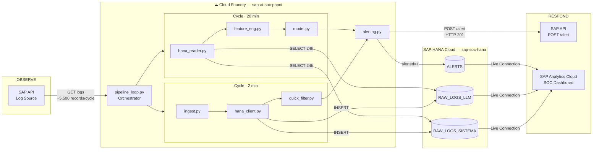

# Reporte Técnico de Arquitectura — Outline Detallado
## SAP AI Security Anomaly Detection Hackathon
## TEC de Monterrey × SAP · Mayo 2026

> **Propósito de este documento:** Outline de trabajo para el reporte técnico de arquitectura requerido como entregable de la Primera Etapa (20 pts). Cada sección incluye los puntos clave que debe cubrir y las preguntas que debe responder.

## 1. Executive Summary

### The Problem

Enterprise systems running on SAP Business Technology Platform (BTP) generate thousands of security-relevant events every minute — HTTP access attempts, authentication failures, AI model interactions, and service errors. Without automated monitoring, these events go unreviewed until a breach has already occurred. The industry standard Mean Time to Detect (MTTD) for security incidents ranges from hours to days, a window large enough for an attacker to cause significant damage to critical business operations.

### The Solution

We built a fully automated **Security Operations Center (SOC)** for SAP systems that ingests security logs in real time, detects anomalous behavior using a dual-layer detection engine, and dispatches alerts to the SAP security team without any human intervention. The system follows the complete security pipeline:

**OBSERVE → ANALYZE → DETECT → RESPOND**

The pipeline runs continuously on SAP Cloud Foundry, polling the SAP API every 2 minutes, persisting data to SAP HANA Cloud, and triggering alerts within seconds of detecting a threat. Detection combines deterministic rule-based filtering (Quick Filter) with unsupervised Machine Learning models (Isolation Forest × 2 + Local Outlier Factor), covering both known attack patterns and statistically anomalous behavior that no predefined rule could capture.

### System Status — May 10, 2026

| Component | Status |
|---|---|
| Ingestion pipeline (Cloud Foundry, 24/7) | ✅ Operational |
| SAP HANA Cloud persistence (3 tables) | ✅ Operational |
| Quick Filter — 6 deterministic rules | ✅ Operational |
| ML model — IF Sistema + IF LLM + LOF by IP | ✅ Operational |
| Alerting — POST /alert to SAP API | ✅ Operational |
| SAC Live Connection — CV_LOGS_LLM | ✅ Operational |
| SAC Live Connection — CV_LOGS_SISTEMA | ✅ Operational |
| SAC Live Connection — CV_ALERTS | ✅ Operational |
| SAC SOC Dashboard | ✅ Operational |

### Key Performance Metrics

| Metric | Target | Result |
|---|---|---|
| Mean Time to Detect (MTTD) | ≤ 2 minutes | **~1 second** |
| Alert latency (detection → SAP confirmation) | As low as possible | **188–310 ms** |
| Pipeline uptime | Continuous | **24/7 since April 24** |
| Human intervention required | None | **0 interventions** |
| System logs ingested (RAW_LOGS_SISTEMA) | — | **1,734,606 records** |
| LLM logs ingested (RAW_LOGS_LLM) | — | **1,027,563 records** |
| Total records in HANA | — | **2,762,169 records** |
| Alerts confirmed by SAP (HTTP 201) | — | **1,537 alerts** |

### Business Impact in One Line

Our SOC detects threats in **~1 second** — reducing the industry-standard detection window from hours or days to under a second, with zero human intervention, operating continuously since April 24, 2026.

# Sections 2–4 — Technical Architecture Report
## SAP AI Security Anomaly Detection SOC
### TEC de Monterrey × SAP · May 2026

---

## 2. Context and Business Problem

### 2.1 The SAP Ecosystem and Its Criticality

SAP Business Technology Platform (BTP) is the cloud infrastructure layer that powers the digital operations of thousands of enterprise organizations worldwide. Companies rely on SAP BTP to run their most critical business functions — financial reporting, human resources, supply chain management, procurement, and enterprise AI services. The platform hosts applications that process sensitive data at scale: employee records, financial transactions, vendor contracts, and operational metrics.

Because of this centrality, SAP systems are high-value targets. A successful attack on a SAP BTP environment can paralyze an organization's core operations, expose confidential data, or generate significant financial loss — not only from the breach itself but from regulatory penalties, recovery costs, and reputational damage.

### 2.2 The Security Monitoring Problem

Despite the criticality of SAP environments, real-time security monitoring remains an unsolved challenge for most organizations. The fundamental issues are:

**No labeled attack history.** Unlike spam detection or fraud prevention, there is no large dataset of labeled SAP security incidents. Attacks are rare, novel, and organizationally specific. This makes supervised machine learning approaches — which require labeled examples — impractical as a primary detection strategy.

**Volume and velocity.** A single SAP BTP environment generates thousands of security-relevant events every 30 minutes — HTTP access attempts, authentication failures, AI model interactions, service errors, and audit events. Manual review at this scale is not feasible.

**Detection latency.** The industry standard Mean Time to Detect (MTTD) for security incidents ranges from hours to days. During that window, an attacker who has gained unauthorized access can exfiltrate data, escalate privileges, or disrupt services. Every minute of undetected activity increases the potential impact.

**Two distinct attack surfaces.** Modern SAP BTP environments expose two fundamentally different attack surfaces that require different monitoring strategies: the traditional HTTP application layer (authentication attacks, path scanning, unauthorized access) and the emerging AI layer (abuse of generative AI services, cost manipulation, model degradation).

### 2.3 Why an Automated SOC

A Security Operations Center (SOC) is the function responsible for continuously monitoring, detecting, and responding to security threats. Traditional SOCs rely on human analysts reviewing alerts — a model that does not scale to the volume and speed of modern threats.

Our automated SOC eliminates the dependency on manual review by combining deterministic rule-based detection for known attack patterns with unsupervised machine learning for unknown anomalies. The system operates continuously without human intervention, dispatching alerts to the SAP security team within seconds of detecting a threat.

### 2.4 Who This Solves a Problem For

The primary beneficiaries of this system are **Chief Information Security Officers (CISOs) and security operations teams** at organizations running business-critical workloads on SAP BTP. For these teams, a detection latency of hours or days is not an acceptable operational risk. Our system reduces that window to approximately one second — a difference of several orders of magnitude — while requiring zero ongoing human intervention to operate.

---

## 3. General System Architecture

### 3.1 High-Level Overview

The system implements the complete security operations pipeline across four stages:

```
OBSERVE → ANALYZE → DETECT → RESPOND
```

Each stage maps to a specific set of components and responsibilities:

- **OBSERVE:** The SAP API continuously generates security logs from applications running on BTP. Our ingestion pipeline polls this API every 2 minutes, retrieving all records from the current 30-minute window.
- **ANALYZE:** Ingested data is persisted to SAP HANA Cloud and processed through a dual-layer detection engine — a fast rule-based filter and a slower but deeper ML model.
- **DETECT:** Both detection layers identify threats and produce structured alert payloads describing what was found, when it occurred, and why it is suspicious.
- **RESPOND:** Alerts are dispatched automatically to the SAP security team via the API's alerting endpoint, with confirmation tracking and retry logic.

### 3.2 Architecture Diagram



### 3.3 SAP Ecosystem Components

#### SAP BTP (Business Technology Platform)
The cloud platform that hosts all project infrastructure. BTP provides the organizational structure (Global Account → Subaccount → Space) and the managed services (Cloud Foundry runtime, HANA Cloud database, Analytics Cloud) that the system depends on. Using BTP as the deployment target is a deliberate design choice: it ensures the solution is native to the SAP ecosystem, directly auditable by SAP evaluators, and production-ready without requiring third-party cloud infrastructure.

#### Cloud Foundry
The application runtime within BTP where the Python pipeline runs continuously. Cloud Foundry manages dependency installation via `requirements.txt`, process lifecycle (automatic restart on failure), and environment variable injection via `VCAP_SERVICES` and `cf set-env`. The pipeline is deployed with `health-check-type: process` — CF monitors that the Python process is alive, not an HTTP endpoint, which is the correct model for a long-running background worker.

**Why Cloud Foundry over a standalone server:** CF eliminates infrastructure management. There is no VM to patch, no daemon to configure, and no manual restart logic to implement. The pipeline runs 24/7 without depending on any team member's machine being online.

#### SAP HANA Cloud
The relational database where all ingested logs and detected alerts are persisted. HANA Cloud was chosen over general-purpose databases (PostgreSQL, MongoDB) for three reasons: native integration with the SAP ecosystem, direct connectivity to SAP Analytics Cloud via Live Connection (no data export required), and columnar storage optimized for the analytical aggregations the ML model performs over 24-hour data windows.

The system uses two separate tables for system logs and LLM logs rather than a single unified table, because the two log types have entirely different column structures with approximately 50% null fields if merged — a design that would complicate queries and waste storage.

#### SAP Analytics Cloud (SAC)
The executive visualization layer connected directly to HANA via Live Connection. SAC reads data from HANA in real time through Calculation Views exposed by an HDI Container (`Prod_Vizz`), eliminating the need to export or transform data for visualization. Dashboards update automatically as new records arrive from the pipeline.

**Why SAC over Streamlit:** SAC is a native SAP tool, satisfying the ecosystem integration criterion of the evaluation rubric. It also provides enterprise-grade dashboard capabilities without requiring custom frontend development, freeing the team to focus on the detection logic.

### 3.4 Key Architectural Decisions

| Decision | Choice Made | Rationale |
|---|---|---|
| Polling interval | 2 minutes (not 30) | Reduces MTTD from ~30 min to ~1 sec; API windows are 30 min but polling more frequently allows near-real-time detection within a window |
| Two detection cycles | Fast (2 min) + Slow (28 min) | Rules need low latency; ML needs data volume. Separating them optimizes each independently |
| Two HANA tables | Sistema + LLM separate | Different schemas, different features, different models — merging would create ~50% null columns per row |
| CSV backup | Always written | If HANA is unavailable, no data is lost. The pipeline continues with local persistence |
| Unsupervised ML | Isolation Forest + LOF | No labeled attack history exists. The system must learn what is normal and flag deviations |

---

## 4. Data Pipeline

### 4.1 The Data Source: SAP API

The SAP API is the exclusive source of all security log data. It exposes three endpoints relevant to the pipeline:

| Endpoint | Auth | Purpose |
|---|---|---|
| `GET /health` | None | Liveness probe — verify the server is running |
| `GET /info` | Bearer Token | Window metadata: `total_pages`, `total_records`, `batch_size` |
| `GET /logs/current?page=N` | Bearer Token | Paginated log records for the current 30-minute window |

**Temporal behavior — 30-minute windows:** The API always serves the currently active UTC 30-minute window. There is no historical data access. If a window is not ingested before it closes, those records are permanently lost.

| UTC Minute | Window Served |
|---|---|
| 00 – 29 | HH:00:00 → HH:30:00 |
| 30 – 59 | HH:30:00 → HH+1:00:00 |

**Pagination:** Records are returned in pages of 500. A typical window contains approximately 5,500–5,729 records across ~12 pages. The pipeline must call `GET /info` first to discover `total_pages`, then iterate through all pages to retrieve the complete window.

**Two log categories:** All records include a discriminant column `sap_function_log_type` that determines the record's category:

| Category | Values | Empty Columns |
|---|---|---|
| **System** | `INFO`, `WARNING`, `ERROR`, `DEBUG`, `AUDIT`, `PERF`, `SECURITY` | All `llm_*` columns |
| **LLM** | `LLM_REQUEST`, `LLM_ERROR`, `LLM_TIMEOUT` | `service_id`, `http_status_code`, `client_ip` |

Null values in columns that do not apply to a given log type are intentional by API design — they are not data quality issues and must not be filled or corrected.

### 4.2 Ingestion Loop and Synchronization

The pipeline's core loop is designed to poll the API precisely at each 30-minute window boundary without accumulating timing drift:

1. **On startup:** Execute one immediate ingestion cycle to capture the current window without waiting.
2. **Calculate sleep time:** Compute the exact number of seconds until the next `:00` or `:30` UTC boundary, plus a 2-second safety margin to ensure the API has loaded the new window's data.
3. **Sleep exactly:** Use `time.sleep(seconds_until_next_boundary)` — not a fixed `time.sleep(1800)` — to avoid cumulative drift that would eventually miss window boundaries.
4. **Repeat indefinitely.**

**Why 2 minutes and not 30:** Although the API window changes every 30 minutes, the pipeline polls every 2 minutes within each window. This is the mechanism that achieves a MTTD of ~1 second: new records injected into the current window are picked up on the next 2-minute poll, not at the end of the 30-minute window.

### 4.3 Deduplication

Because the pipeline polls multiple times within the same 30-minute window, it will retrieve records it has already processed. Deduplication is implemented in two layers:

**Layer 1 — In-memory set:** A Python `set` of processed record IDs is maintained in memory across cycles within the same process session. Lookups are O(1).

**Layer 2 — HANA query:** On each cycle, the pipeline queries HANA for IDs already persisted, catching any records that were processed in a previous process session (after a restart or redeployment).

The two layers together guarantee that no record is inserted into HANA more than once, regardless of how many times the pipeline has restarted.

### 4.4 ETL and Data Cleaning

Before persisting to HANA, the raw data undergoes the following transformations:

- **Remove Elasticsearch internal fields:** `_score`, `_ignored`, and `_index` are metadata fields from the upstream log storage system with no analytical value.
- **Normalize timestamps:** `@timestamp` and `@event_time_requested` are converted to `datetime64` in UTC.
- **Normalize numeric columns:** LLM metric columns (`llm_cost_usd`, `llm_response_time_ms`, `llm_total_tokens`, etc.) are cast to `float64`.
- **Normalize booleans:** `llm_stream` is converted from string `"TRUE"`/`"FALSE"` to Python `bool`.
- **Separate by log type:** System and LLM records are split into separate DataFrames for independent insertion into their respective HANA tables.

The ETL is **idempotent** — running it N times over the same data produces the same result. This makes the pipeline predictable and safe to retry.

### 4.5 Persistence in SAP HANA Cloud

**Insertion strategy:** Records are inserted using `cursor.executemany()`, which sends all rows in a single SQL operation to the HANA server — O(1) in server round trips, not O(n). This reduced insertion time from approximately 9 minutes (row-by-row) to 16 seconds for a full window.

**Null handling:** pandas represents missing values as `float('nan')`, but HANA expects Python `None` to insert SQL `NULL`. A set of type-safe conversion functions (`_safe_str`, `_safe_float`, `_safe_int`, `_safe_ts`) converts all NaN values to None before insertion. Without this, each null value would cause a type error at the database level.

**HANA availability fallback:** If the HANA connection fails or the instance is paused (a known behavior of trial instances during inactivity), the pipeline does not stop. It logs the error, writes the CSV backup, and continues to the next cycle. No data is lost.

### 4.6 HANA Table Schemas

#### RAW_LOGS_SISTEMA
Stores all system log events — HTTP access attempts, authentication events, application errors, and security-flagged activity.

| Column | Type | Description |
|---|---|---|
| `ID` | INTEGER | Auto-generated internal identifier |
| `LOG_ID` | NVARCHAR | Unique event identifier from the API |
| `EVENT_TIMESTAMP` | TIMESTAMP | When the event occurred (UTC) |
| `INGESTED_AT` | TIMESTAMP | When the pipeline collected this record |
| `LOG_TYPE` | NVARCHAR | Event type: INFO, WARNING, ERROR, DEBUG, AUDIT, PERF, SECURITY |
| `APPLICATION` | NVARCHAR | SAP application that generated the event |
| `MESSAGE` | NVARCHAR | Descriptive message |
| `ENVIRONMENT` | NVARCHAR | Execution environment (e.g. production, staging) |
| `REGION_NAME` | NVARCHAR | Geographic region of the server |
| `REGION_CODE` | NVARCHAR | Short region code |
| `MACRO_REGION` | NVARCHAR | Broad region grouping (Americas, EMEA, etc.) |
| `SERVICE_ID` | NVARCHAR | SAP service identifier |
| `HTTP_STATUS` | NVARCHAR | HTTP response code (200, 401, 404, 500, etc.) |
| `CLIENT_IP` | NVARCHAR | IP address of the requesting client |
| `REQUEST_METHOD` | NVARCHAR | HTTP method: GET, POST, DELETE, etc. |
| `REQUEST_PATH` | NVARCHAR | URL path of the request |

**Volume as of May 10, 2026:** 1,734,606 records

#### RAW_LOGS_LLM
Stores all interactions with AI language models through the SAP Generative AI Hub.

| Column | Type | Description |
|---|---|---|
| `ID` | INTEGER | Auto-generated internal identifier |
| `LOG_ID` | NVARCHAR | Unique event identifier from the API |
| `EVENT_TIMESTAMP` | TIMESTAMP | When the event occurred (UTC) |
| `INGESTED_AT` | TIMESTAMP | When the pipeline collected this record |
| `LOG_TYPE` | NVARCHAR | LLM_REQUEST, LLM_ERROR, or LLM_TIMEOUT |
| `APPLICATION` | NVARCHAR | Application that made the LLM request |
| `MESSAGE` | NVARCHAR | Descriptive message |
| `ENVIRONMENT` | NVARCHAR | Execution environment |
| `REGION_NAME` | NVARCHAR | Geographic region |
| `REGION_CODE` | NVARCHAR | Short region code |
| `MACRO_REGION` | NVARCHAR | Broad region grouping |
| `LLM_MODEL_ID` | NVARCHAR | AI model used (e.g. gpt-4, claude-3) |
| `LLM_PROVIDER` | NVARCHAR | Model provider (OpenAI, Anthropic, etc.) |
| `LLM_STATUS` | NVARCHAR | Request outcome: success, error, timeout |
| `LLM_ERROR_MESSAGE` | NVARCHAR | Error description when status is error |
| `LLM_PROMPT_CATEGORY` | NVARCHAR | Category of the prompt/task |
| `LLM_TOTAL_TOKENS` | INTEGER | Total tokens processed (prompt + completion) |
| `LLM_COST_USD` | DOUBLE | Cost of the request in USD |
| `LLM_RESPONSE_TIME` | DOUBLE | Response time in milliseconds |
| `LLM_TEMPERATURE` | DOUBLE | Model creativity parameter (0.0–1.0) |
| `LLM_FINISH_REASON` | NVARCHAR | Why the response ended: stop, length, error |

**Volume as of May 10, 2026:** 1,027,563 records

#### ALERTS
Stores every threat detected by the system, regardless of whether the alert was successfully dispatched.

| Column | Type | Description |
|---|---|---|
| `ALERT_ID` | NVARCHAR | Unique alert identifier (UUID) |
| `LOG_ID` | NVARCHAR | ID of the triggering log record |
| `DETECTED_AT` | TIMESTAMP | When the threat was detected |
| `DETECTION_SOURCE` | NVARCHAR | `quick_filter` or `model_ml` |
| `ALERT_TYPE` | NVARCHAR | Type of threat detected |
| `SEVERITY` | NVARCHAR | `low`, `medium`, or `high` |
| `DETAILS` | NVARCHAR | Human-readable description (max 300 chars) |
| `WINDOW_START` | TIMESTAMP | Start of the data window that produced this alert |
| `ALERTED` | INTEGER | 0 = detected, POST pending or failed · 1 = confirmed by SAP (HTTP 201) |

**Confirmed alerts as of May 10, 2026:** 1,537 (alerted = 1)

### 4.7 CSV Backup

In parallel to HANA insertion, every ingestion cycle writes a CSV file to `data/raw/logs_[timestamp].csv`. This serves as a permanent local backup of all raw data, independent of HANA availability. Files are named with the UTC timestamp of the ingestion cycle and accumulate over time, one file per cycle.

The backup is not a fallback that replaces HANA — it is an additional layer of data durability. If HANA becomes unavailable for any reason, the raw data exists locally and can be re-ingested when the connection is restored.
## 5. Pipeline de Datos

### 5.1 La fuente de datos: API SAP
- Los tres endpoints disponibles y su propósito
- El comportamiento de ventanas de 30 minutos — datos irrecuperables si se pierden
- Paginación: 500 registros por página, ~12 páginas por ventana
- Los dos tipos de logs: Sistema y LLM — columna discriminante `sap_function_log_type`
- Nulos por diseño — no son errores de calidad

### 5.2 Ingesta y deduplicación
- El loop de automatización: cálculo exacto de segundos hasta próximo :00 o :30 UTC
- Primera ejecución inmediata al arrancar el pipeline
- Deduplicación en dos capas: set Python en memoria + SELECT de IDs en HANA
- Por qué dos capas: la primera es O(1) y evita queries innecesarias a HANA

### 5.3 ETL y limpieza
- Eliminación de columnas internas de Elasticsearch (`_score`, `_ignored`, `_index`)
- Normalización de timestamps a `datetime64 UTC`
- Normalización de columnas numéricas a `float64`
- Separación de logs Sistema vs LLM

### 5.4 Persistencia
- Inserción en HANA con `executemany()` — O(1) en llamadas al servidor
- Backup en CSV local como fallback — el pipeline continúa si HANA no está disponible
- Gestión de nulos: conversión de `float('nan')` a `None` para NULL en HANA

### 5.5 Schema de las tablas HANA
- Tabla `RAW_LOGS_SISTEMA`: columnas clave, tipos, volumen actual
- Tabla `RAW_LOGS_LLM`: columnas clave, tipos, volumen actual
- Tabla `ALERTS`: columnas, campo `alerted` (0=pendiente, 1=confirmada por SAP)

---

## 6. Detección de Amenazas — Quick Filter

### 6.1 Rol del Quick Filter en el sistema
- Por qué reglas determinísticas antes que ML: latencia, interpretabilidad, cobertura de casos conocidos
- Opera sobre `df_nuevos` antes del ETL — no necesita normalización
- Agrupación por batch: una alerta por tipo y no una por registro — por qué es crítico

### 6.2 Las 6 reglas implementadas
Para cada regla: qué detecta, en qué tipo de log, la lógica exacta, y la severidad asignada.

- **Regla 1 — Security Event:** `log_type == 'SECURITY'` · severidad HIGH/MEDIUM por conteo de IPs
- **Regla 2 — Brute Force:** ≥5 errores HTTP 401/403 desde la misma IP en un ciclo · HIGH
- **Regla 3 — Path Scan:** ≥3 peticiones 404 a rutas sospechosas desde la misma IP · MEDIUM/HIGH
- **Regla 4 — High Cost LLM Error:** `LLM_ERROR` con `llm_cost_usd > 1.0` · HIGH/MEDIUM
- **Regla 5 — LLM Timeout:** cualquier `LLM_TIMEOUT` · HIGH/MEDIUM por conteo
- **Regla 6 — Slow LLM Response:** `llm_response_time_ms > 10,000` · MEDIUM/LOW

### 6.3 Clasificación según taxonomía de seguridad
- Mapeo de reglas a familias Tenable/Nessus: Brute Force Attacks, CGI Abuses, Web Servers, Artificial Intelligence

### 6.4 Resultados en producción
- Tipos de amenazas más frecuentes detectadas
- Distribución de severidades

---

## 7. Detección de Anomalías — Modelo de Machine Learning

### 7.1 Justificación del enfoque no supervisado
- Por qué no supervisado: ausencia de etiquetas, naturaleza desconocida de los ataques
- Alternativas consideradas y por qué se descartaron
- El principio: aprender lo normal y detectar desviaciones

### 7.2 Los tres modelos

#### Isolation Forest — Logs de Sistema
- Propósito: detectar eventos individuales anómalos en actividad web
- Features utilizadas (9): `status_family`, `is_4xx`, `is_5xx`, `is_401_or_403`, `is_429`, `hour_utc`, `LOG_TYPE`, `APPLICATION`, `REGION_NAME`
- Hiperparámetros: `n_estimators=200`, `max_samples=256`, `contamination='auto'`, `random_state=42`
- Complejidad: O(t × n × log n)

#### Isolation Forest — Logs de LLM
- Propósito: detectar peticiones LLM anómalas en costo, tiempo o tokens
- Features utilizadas: `log1p(LLM_COST_USD)`, `log1p(LLM_RESPONSE_TIME)`, `log1p(LLM_TOTAL_TOKENS)`, `LLM_STATUS`, `LLM_PROVIDER`, `LLM_MODEL_ID`
- Por qué `log1p`: distribución heavy-tail de las métricas LLM
- Hiperparámetros: mismos que IF Sistema

#### Local Outlier Factor — Comportamiento por IP
- Propósito: detectar IPs con comportamiento agregado anómalo (no eventos individuales)
- Por qué LOF y no IF para este caso: LOF compara densidades locales, captura comportamiento relativo entre IPs
- Features: métricas agregadas por IP — conteo de peticiones, diversidad de rutas, tasa de errores, distribución de códigos HTTP
- Hiperparámetros: `n_neighbors=20`, `contamination='auto'`
- `RobustScaler` previo al LOF: por qué — LOF calcula distancias euclidianas, features en rangos muy distintos

### 7.3 Feature Engineering
- `OrdinalEncoder` para variables categóricas
- Flags booleanos para códigos HTTP críticos
- `log1p()` para métricas con distribución heavy-tail
- `RobustScaler` para LOF

### 7.4 Thresholding con MAD
- Por qué MAD y no desviación estándar: robustez ante outliers
- Fórmula: `threshold = median - 3.5 × (MAD / 0.6745)`
- Modo histórico (≥20 ventanas): usa percentil acumulado
- Cap de 5 alertas por ciclo ML ordenadas por severidad

### 7.5 Resultados en producción
- Primera ejecución (4 mayo 2026): volumen de datos, anomalías detectadas, tiempo de ejecución
- Ejemplos de anomalías detectadas

---

## 8. Sistema de Alerting

### 8.1 El endpoint de alertas
- `POST /alert` en la misma API SAP — mismo `BEARER_TOKEN`
- Formato del mensaje: `WHAT: ... WHEN: ... WHY: ...` · máximo 300 caracteres
- Respuesta exitosa: HTTP 201 (no 200)

### 8.2 Garantías del sistema
- Anti-duplicados: verificación por `log_id` antes de cada envío
- Retry con backoff exponencial: 1s → 2s, máximo 3 intentos ante 5xx o timeout
- `enviar_alerta()` nunca lanza excepciones — errores quedan en `AlertResult.error`
- Registro en `DBADMIN.ALERTS`: `alerted=0` al detectar, `alerted=1` al confirmar HTTP 201

### 8.3 Métricas de alerting
- Latencia de confirmación: 188–310 ms (detección → HTTP 201 de SAP)
- Tasa de alertas confirmadas vs fallidas
- Source de cada alerta: `quick_filter` o `model_ml`

---

## 9. Visualización — SAP Analytics Cloud

### 9.1 Arquitectura de la conexión SAC–HANA
- HDI Container `Prod_Vizz`: qué es y por qué se necesita para la Live Connection
- Synonyms: puente entre el schema DBADMIN y el HDI Container
- Calculation Views: tipo CUBE, measures y attributes expuestos a SAC

### 9.2 Estado actual de los Calculation Views
- `CV_LOGS_LLM` ✅ — operativo: measures (tokens, costo, tiempo de respuesta), attributes (proveedor, modelo, región, status)
- `CV_LOGS_SISTEMA` ⏳ — en progreso
- `CV_ALERTS` ⏳ — en progreso

### 9.3 Usuarios y acceso a SAC
- `SAC_USER`: permisos SELECT + roles HDI `access_role` y `external_privileges_role`
- Separación de usuarios: SAC_USER ≠ PIPELINE_USER ≠ DBADMIN

### 9.4 Dashboard del SOC
- Métricas y visualizaciones planeadas
- Screenshots del dashboard actual *(insertar evidencia)*

---

## 10. MLOps y Despliegue en Cloud Foundry

### 10.1 Configuración del despliegue
- `manifest.yml`: comando de inicio, `health-check-type: process`, memoria, instancias
- `requirements.txt`: dependencias del entorno de producción
- `runtime.txt`: versión de Python

### 10.2 Gestión de credenciales por entorno
- Local: `.env` → `os.getenv()` → DBADMIN
- Producción (CF): `cf set-env` → User-Provided variables → PIPELINE_USER
- La función `_load_hana_creds()`: prioridad 1) variables directas, 2) VCAP_SERVICES, 3) falla controlada
- VCAP_SERVICES: hana y xsuaa bound — no consumidos activamente por el código

### 10.3 Monitoreo y observabilidad
- Logging dual: consola (tiempo real) + `pipeline.log` (historial persistente)
- Cada mensaje incluye hora UTC y hora Monterrey (CDT = UTC-6)
- `cf logs sap-ai-soc-papoi --recent` para diagnóstico

### 10.4 Manejo de errores en el loop
- HTTP 401 → `sys.exit(1)` — fatal, no sirve reintentar
- HTTP 5xx / Timeout → esperar 60s + reintentar
- HANA no disponible → continuar solo con CSV
- `KeyboardInterrupt` → cierre limpio con reporte de ciclos completados

### 10.5 Diagrama del Pipeline Loop
- *(insertar Slide 3 del PowerPoint)*

---

## 11. Seguridad y Gestión de Credenciales

### 11.1 Separación de usuarios por principio de mínimo privilegio
- `DBADMIN`: acceso total — solo para administración y setup
- `PIPELINE_USER`: SELECT + INSERT + UPDATE sobre las 3 tablas — solo lo necesario para el pipeline
- `SAC_USER`: SELECT + roles HDI — solo lectura para dashboards
- `#OO / #DI`: usuarios técnicos del HDI Container — gestionados por SAP

### 11.2 Gestión de credenciales
- `.env` nunca en Git — verificación con `.gitignore`
- `cf set-env` en lugar de variables hardcodeadas en el código
- `db/.env` y `db/default-env.json` del HDI Container — nunca en Git
- `JOB_SECRET_TOKEN` — legacy, sin uso en producción

### 11.3 Diagrama de usuarios y credenciales
- *(insertar Slide 4 del PowerPoint)*

---

## 12. Funciones Clave del Pipeline

> Para cada función: módulo de origen, propósito, inputs principales, output, y decisión de diseño relevante.

### 12.1 Configuración — `app/config.py`

**`validate_config()`**
Verifica que `API_BASE_URL` y `BEARER_TOKEN` están presentes antes de cualquier llamada HTTP. Falla rápido con mensaje claro.

**`_load_hana_creds()`**
Lee credenciales HANA con tres niveles de fallback: 1) variables directas (`os.getenv`), 2) VCAP_SERVICES, 3) retorna vacío para falla controlada.

**`get_headers()`**
Construye el header de autenticación Bearer en cada llamada — no como variable estática.

---

### 12.2 Ingesta — `app/ingest.py`

**`fetch_current_window()`**
- **Input:** ninguno (lee de config)
- **Output:** `(DataFrame, dict_metadata)`
- Implementa el loop de paginación: GET /info → GET /logs/current?page=1..N → acumula registros → retorna DataFrame completo

**`ingest_and_persist()`**
- **Input:** ninguno
- **Output:** dict con métricas del ciclo (total, nuevos, insertados en HANA)
- Orquesta: `fetch_current_window()` → deduplicación → `save_data()` → `insert_logs()`

---

### 12.3 Persistencia en HANA — `app/hana_client.py`

**`get_connection()`**
- **Input:** credenciales de `config.py`
- **Output:** objeto de conexión `hdbcli` activo
- Parámetros clave: `encrypt=True`, `sslValidateCertificate=False` (trial), `port=443`

**`insert_logs(df)`**
- **Input:** DataFrame con logs del ciclo actual
- **Output:** dict `{"sistema": N, "llm": M}` con conteo de inserciones
- Separa Sistema y LLM → convierte NaN a None → `executemany()` → `conn.commit()`

---

### 12.4 Detección rápida — `app/quick_filter.py`

**`filtrar_amenazas(df_nuevos)`**
- **Input:** DataFrame con registros nuevos (crudos, antes del ETL)
- **Output:** lista de dicts con `alert_type`, `severity`, `details`, `log_id`, `event_time`
- Aplica las 6 reglas en secuencia, agrupando por batch cuando corresponde

---

### 12.5 Alerting — `app/alerting.py`

**`enviar_alerta(alert_type, severity, details, log_id, ...)`**
- **Input:** tipo, severidad, descripción, log_id del registro, y opcionales (conn HANA, window_start, source)
- **Output:** `AlertResult` (dataclass con `success: bool`, `status_code: int`, `error: str`)
- Nunca lanza excepciones · anti-duplicados por log_id · retry x3 backoff exponencial

---

### 12.6 Feature Engineering — `app/feature_eng.py`

**`build_features_sistema(df)`**
- **Input:** DataFrame de logs Sistema
- **Output:** DataFrame con features numéricas para IF Sistema
- Genera flags booleanos de códigos HTTP, extrae hora UTC, aplica OrdinalEncoder

**`build_features_llm(df)`**
- **Input:** DataFrame de logs LLM
- **Output:** DataFrame con features numéricas para IF LLM
- Aplica `log1p()` a costo, tiempo y tokens; OrdinalEncoder a categóricas

**`build_features_ip(df)`**
- **Input:** DataFrame de logs Sistema
- **Output:** DataFrame agregado por IP con métricas de comportamiento
- Agrupa por IP: conteo de peticiones, rutas únicas, tasa de errores, distribución de status

---

### 12.7 Modelo ML — `app/model.py`

**`run_isolation_forest(df_features, label)`**
- **Input:** DataFrame de features, string label para logging
- **Output:** array de anomaly scores
- Entrena IF con hiperparámetros fijos, retorna scores normalizados

**`run_lof(df_features)`**
- **Input:** DataFrame de features agregadas por IP
- **Output:** array de scores LOF
- Aplica RobustScaler previo, entrena LOF, retorna scores

**`_compute_threshold(scores)`**
- **Input:** array de scores históricos
- **Output:** float threshold
- Calcula `median - 3.5 × (MAD / 0.6745)` — robusto ante outliers

**`detectar_anomalias(conn)`**
- **Input:** conexión HANA activa
- **Output:** lista de dicts de amenazas detectadas (mismo contrato que `filtrar_amenazas`)
- Orquesta: `hana_reader` → `feature_eng` → 3 modelos → thresholding → cap de 5 alertas

---

## 13. Riesgos Técnicos y Limitaciones

### 13.1 Riesgos de infraestructura
- **HANA trial se pausa por inactividad:** verificar estado Running antes de cada sesión · fallback CSV mitiga pérdida de datos
- **Ventanas irrecuperables si el pipeline cae:** monitoreo activo con `cf logs` · los organizadores verifican continuidad
- **Plan hana-free con límites de storage:** ~32GB — suficiente para el hackathon, escala en producción real

### 13.2 Riesgos del modelo de detección
- **Falsos positivos en Quick Filter:** umbrales calibrados empíricamente con datos acumulados — pueden requerir ajuste con más contexto
- **Modelo ML sin etiquetas:** no hay ground truth para medir precisión exacta — se evalúa por coherencia de las anomalías detectadas
- **Cap de 5 alertas por ciclo ML:** puede perder anomalías en ciclos con alta actividad — tradeoff deliberado para no saturar el dashboard de SAP

### 13.3 Riesgos de seguridad
- **Credenciales en historial de Git:** verificado con `git log --all -- .env` antes de hacer el repo público
- **Token del equipo comprometido:** penalización de bloqueo al día siguiente — credenciales solo en `.env` local y `cf set-env`

---

## 14. Reporte Forense — Incidentes Reales Detectados

> Esta sección documenta anomalías reales detectadas por el sistema en producción, con datos extraídos de `DBADMIN.ALERTS`.

### 14.1 Metodología del análisis forense
- Fuente de datos: tabla `DBADMIN.ALERTS` con campo `alerted=1` (confirmados por SAP)
- Período analizado: desde el primer deploy (24 abril) hasta la fecha del reporte
- Clasificación usando taxonomía Tenable/Nessus

### 14.2 Incidente 1 — [Tipo de amenaza]
- Qué se detectó
- Cuándo ocurrió (timestamp exacto)
- Qué componente lo identificó (quick_filter / model_ml)
- Qué significa en un entorno de producción real SAP
- Qué acción tomó el sistema automáticamente
- Tiempo de respuesta (detección → confirmación SAP)

### 14.3 Incidente 2 — [Tipo de amenaza]
*(misma estructura)*

### 14.4 Incidente 3 — [Tipo de amenaza]
*(misma estructura)*

### 14.5 Resumen estadístico de alertas detectadas
- Total de alertas generadas (alerted=0 + alerted=1)
- Total de alertas confirmadas por SAP (alerted=1)
- Distribución por tipo de amenaza
- Distribución por severidad
- Distribución por fuente de detección (quick_filter vs model_ml)

---

## 15. Impacto de Negocio

### 15.1 El problema que resolvemos
- Para quién: equipos de seguridad (CISOs) de empresas enterprise que usan SAP BTP
- Qué problema concreto: falta de visibilidad en tiempo real sobre amenazas en sistemas críticos

### 15.2 Métricas de éxito del sistema
| Métrica | Objetivo | Resultado obtenido |
|---|---|---|
| MTTD | ≤ 2 minutos | ~1 segundo |
| Latencia de alerta | Lo más bajo posible | 188–310 ms |
| Cobertura temporal | 24/7 | 24/7 desde Abr 24 |
| Intervención humana requerida | Ninguna | 0 intervenciones |

### 15.3 Comparación con el estándar de la industria
- MTTD estándar: horas a días
- Nuestro MTTD: ~1 segundo — mejora de varios órdenes de magnitud
- Qué significa en términos de impacto: un ataque de brute force que antes se detectaría en horas, ahora genera una alerta en 1 segundo

### 15.4 Escalabilidad y viabilidad en producción
- Cómo escala el sistema más allá del hackathon
- Qué cambiaría para producción real: plan HANA de producción, múltiples instancias CF, etiquetas de ataques para supervisar el modelo
- Visión de autonomous enterprise: cómo el agente IA (tentativo) encaja en la dirección estratégica de SAP

---

## Apéndices

### Apéndice A — Schema completo de las tablas HANA
- Schema de `RAW_LOGS_SISTEMA`: todas las columnas con tipo de dato y descripción
- Schema de `RAW_LOGS_LLM`: todas las columnas con tipo de dato y descripción
- Schema de `ALERTS`: todas las columnas con tipo de dato y descripción

### Apéndice B — Fragmentos de código clave
- `pipeline_loop.py`: lógica de sincronización temporal
- `quick_filter.py`: implementación de la regla de brute force
- `model.py`: función `_compute_threshold()` con MAD
- `hana_client.py`: función `insert_logs()` con `executemany()`

### Apéndice C — Evidencia de implementación
- Screenshots de logs de Cloud Foundry mostrando ciclos completos
- Output de queries HANA con conteos de registros
- Screenshot del dashboard SAC con datos reales
- Logs de alertas confirmadas (HTTP 201)

### Apéndice D — Diagrama de usuarios y credenciales
- *(insertar Slide 4 del PowerPoint)*

### Apéndice E — Queries SQL de referencia
- Queries usadas para el reporte forense
- Queries de verificación de integridad de tablas

---

*Outline generado el 10 de Mayo 2026*
*SAP AI Security Anomaly Detection Hackathon · TEC de Monterrey × SAP*
*Actualizar conforme se complete cada sección*
