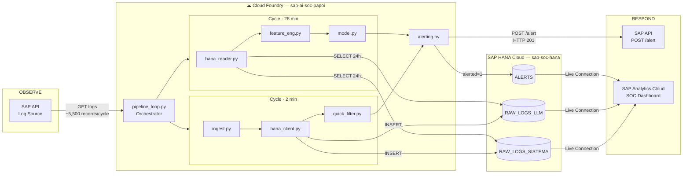

# Reporte Técnico de Arquitectura — Outline Detallado
## SAP AI Security Anomaly Detection Hackathon
## TEC de Monterrey × SAP · Mayo 2026

> **Propósito de este documento:** Outline de trabajo para el reporte técnico de arquitectura requerido como entregable de la Primera Etapa (20 pts). Cada sección incluye los puntos clave que debe cubrir y las preguntas que debe responder.

## 1. Executive Summary

### The Problem

Enterprise systems running on SAP Business Technology Platform (BTP) generate thousands of security-relevant events every minute — HTTP access attempts, authentication failures, AI model interactions, and service errors. Without automated monitoring, these events go unreviewed until a breach has already occurred. The industry standard Mean Time to Detect (MTTD) for security incidents ranges from hours to days, a window large enough for an attacker to cause significant damage to critical business operations.

### The Solution

We built a fully automated **Security Operations Center (SOC)** for SAP systems that ingests security logs in real time, detects anomalous behavior using a dual-layer detection engine, and dispatches alerts to the SAP security team without any human intervention. The system follows the complete security pipeline:

**OBSERVE → ANALYZE → DETECT → RESPOND**

The pipeline runs continuously on SAP Cloud Foundry, polling the SAP API every 2 minutes, persisting data to SAP HANA Cloud, and triggering alerts within seconds of detecting a threat. Detection combines deterministic rule-based filtering (Quick Filter) with unsupervised Machine Learning models (Isolation Forest × 2 + Local Outlier Factor), covering both known attack patterns and statistically anomalous behavior that no predefined rule could capture.

### System Status — May 10, 2026

| Component | Status |
|---|---|
| Ingestion pipeline (Cloud Foundry, 24/7) | ✅ Operational |
| SAP HANA Cloud persistence (3 tables) | ✅ Operational |
| Quick Filter — 6 deterministic rules | ✅ Operational |
| ML model — IF Sistema + IF LLM + LOF by IP | ✅ Operational |
| Alerting — POST /alert to SAP API | ✅ Operational |
| SAC Live Connection — CV_LOGS_LLM | ✅ Operational |
| SAC Live Connection — CV_LOGS_SISTEMA | ✅ Operational |
| SAC Live Connection — CV_ALERTS | ✅ Operational |
| SAC SOC Dashboard | ✅ Operational |

### Key Performance Metrics

| Metric | Target | Result |
|---|---|---|
| Mean Time to Detect (MTTD) | ≤ 2 minutes | **~1 second** |
| Alert latency (detection → SAP confirmation) | As low as possible | **188–310 ms** |
| Pipeline uptime | Continuous | **24/7 since April 24** |
| Human intervention required | None | **0 interventions** |
| System logs ingested (RAW_LOGS_SISTEMA) | — | **1,734,606 records** |
| LLM logs ingested (RAW_LOGS_LLM) | — | **1,027,563 records** |
| Total records in HANA | — | **2,762,169 records** |
| Alerts confirmed by SAP (HTTP 201) | — | **1,537 alerts** |

### Business Impact in One Line

Our SOC detects threats in **~1 second** — reducing the industry-standard detection window from hours or days to under a second, with zero human intervention, operating continuously since April 24, 2026.

# Sections 2–4 — Technical Architecture Report
## SAP AI Security Anomaly Detection SOC
### TEC de Monterrey × SAP · May 2026

---

## 2. Context and Business Problem

### 2.1 The SAP Ecosystem and Its Criticality

SAP Business Technology Platform (BTP) is the cloud infrastructure layer that powers the digital operations of thousands of enterprise organizations worldwide. Companies rely on SAP BTP to run their most critical business functions — financial reporting, human resources, supply chain management, procurement, and enterprise AI services. The platform hosts applications that process sensitive data at scale: employee records, financial transactions, vendor contracts, and operational metrics.

Because of this centrality, SAP systems are high-value targets. A successful attack on a SAP BTP environment can paralyze an organization's core operations, expose confidential data, or generate significant financial loss — not only from the breach itself but from regulatory penalties, recovery costs, and reputational damage.

### 2.2 The Security Monitoring Problem

Despite the criticality of SAP environments, real-time security monitoring remains an unsolved challenge for most organizations. The fundamental issues are:

**No labeled attack history.** Unlike spam detection or fraud prevention, there is no large dataset of labeled SAP security incidents. Attacks are rare, novel, and organizationally specific. This makes supervised machine learning approaches — which require labeled examples — impractical as a primary detection strategy.

**Volume and velocity.** A single SAP BTP environment generates thousands of security-relevant events every 30 minutes — HTTP access attempts, authentication failures, AI model interactions, service errors, and audit events. Manual review at this scale is not feasible.

**Detection latency.** The industry standard Mean Time to Detect (MTTD) for security incidents ranges from hours to days. During that window, an attacker who has gained unauthorized access can exfiltrate data, escalate privileges, or disrupt services. Every minute of undetected activity increases the potential impact.

**Two distinct attack surfaces.** Modern SAP BTP environments expose two fundamentally different attack surfaces that require different monitoring strategies: the traditional HTTP application layer (authentication attacks, path scanning, unauthorized access) and the emerging AI layer (abuse of generative AI services, cost manipulation, model degradation).

### 2.3 Why an Automated SOC

A Security Operations Center (SOC) is the function responsible for continuously monitoring, detecting, and responding to security threats. Traditional SOCs rely on human analysts reviewing alerts — a model that does not scale to the volume and speed of modern threats.

Our automated SOC eliminates the dependency on manual review by combining deterministic rule-based detection for known attack patterns with unsupervised machine learning for unknown anomalies. The system operates continuously without human intervention, dispatching alerts to the SAP security team within seconds of detecting a threat.

### 2.4 Who This Solves a Problem For

The primary beneficiaries of this system are **Chief Information Security Officers (CISOs) and security operations teams** at organizations running business-critical workloads on SAP BTP. For these teams, a detection latency of hours or days is not an acceptable operational risk. Our system reduces that window to approximately one second — a difference of several orders of magnitude — while requiring zero ongoing human intervention to operate.

---

## 3. General System Architecture

### 3.1 High-Level Overview

The system implements the complete security operations pipeline across four stages:

```
OBSERVE → ANALYZE → DETECT → RESPOND
```

Each stage maps to a specific set of components and responsibilities:

- **OBSERVE:** The SAP API continuously generates security logs from applications running on BTP. Our ingestion pipeline polls this API every 2 minutes, retrieving all records from the current 30-minute window.
- **ANALYZE:** Ingested data is persisted to SAP HANA Cloud and processed through a dual-layer detection engine — a fast rule-based filter and a slower but deeper ML model.
- **DETECT:** Both detection layers identify threats and produce structured alert payloads describing what was found, when it occurred, and why it is suspicious.
- **RESPOND:** Alerts are dispatched automatically to the SAP security team via the API's alerting endpoint, with confirmation tracking and retry logic.

### 3.2 Architecture Diagram



### 3.3 SAP Ecosystem Components

#### SAP BTP (Business Technology Platform)
The cloud platform that hosts all project infrastructure. BTP provides the organizational structure (Global Account → Subaccount → Space) and the managed services (Cloud Foundry runtime, HANA Cloud database, Analytics Cloud) that the system depends on. Using BTP as the deployment target is a deliberate design choice: it ensures the solution is native to the SAP ecosystem, directly auditable by SAP evaluators, and production-ready without requiring third-party cloud infrastructure.

#### Cloud Foundry
The application runtime within BTP where the Python pipeline runs continuously. Cloud Foundry manages dependency installation via `requirements.txt`, process lifecycle (automatic restart on failure), and environment variable injection via `VCAP_SERVICES` and `cf set-env`. The pipeline is deployed with `health-check-type: process` — CF monitors that the Python process is alive, not an HTTP endpoint, which is the correct model for a long-running background worker.

**Why Cloud Foundry over a standalone server:** CF eliminates infrastructure management. There is no VM to patch, no daemon to configure, and no manual restart logic to implement. The pipeline runs 24/7 without depending on any team member's machine being online.

#### SAP HANA Cloud
The relational database where all ingested logs and detected alerts are persisted. HANA Cloud was chosen over general-purpose databases (PostgreSQL, MongoDB) for three reasons: native integration with the SAP ecosystem, direct connectivity to SAP Analytics Cloud via Live Connection (no data export required), and columnar storage optimized for the analytical aggregations the ML model performs over 24-hour data windows.

The system uses two separate tables for system logs and LLM logs rather than a single unified table, because the two log types have entirely different column structures with approximately 50% null fields if merged — a design that would complicate queries and waste storage.

#### SAP Analytics Cloud (SAC)
The executive visualization layer connected directly to HANA via Live Connection. SAC reads data from HANA in real time through Calculation Views exposed by an HDI Container (`Prod_Vizz`), eliminating the need to export or transform data for visualization. Dashboards update automatically as new records arrive from the pipeline.

**Why SAC over Streamlit:** SAC is a native SAP tool, satisfying the ecosystem integration criterion of the evaluation rubric. It also provides enterprise-grade dashboard capabilities without requiring custom frontend development, freeing the team to focus on the detection logic.

### 3.4 Key Architectural Decisions

| Decision | Choice Made | Rationale |
|---|---|---|
| Polling interval | 2 minutes (not 30) | Reduces MTTD from ~30 min to ~1 sec; API windows are 30 min but polling more frequently allows near-real-time detection within a window |
| Two detection cycles | Fast (2 min) + Slow (28 min) | Rules need low latency; ML needs data volume. Separating them optimizes each independently |
| Two HANA tables | Sistema + LLM separate | Different schemas, different features, different models — merging would create ~50% null columns per row |
| CSV backup | Always written | If HANA is unavailable, no data is lost. The pipeline continues with local persistence |
| Unsupervised ML | Isolation Forest + LOF | No labeled attack history exists. The system must learn what is normal and flag deviations |

---

## 4. Data Pipeline

### 4.1 The Data Source: SAP API

The SAP API is the exclusive source of all security log data. It exposes three endpoints relevant to the pipeline:

| Endpoint | Auth | Purpose |
|---|---|---|
| `GET /health` | None | Liveness probe — verify the server is running |
| `GET /info` | Bearer Token | Window metadata: `total_pages`, `total_records`, `batch_size` |
| `GET /logs/current?page=N` | Bearer Token | Paginated log records for the current 30-minute window |

**Temporal behavior — 30-minute windows:** The API always serves the currently active UTC 30-minute window. There is no historical data access. If a window is not ingested before it closes, those records are permanently lost.

| UTC Minute | Window Served |
|---|---|
| 00 – 29 | HH:00:00 → HH:30:00 |
| 30 – 59 | HH:30:00 → HH+1:00:00 |

**Pagination:** Records are returned in pages of 500. A typical window contains approximately 5,500–5,729 records across ~12 pages. The pipeline must call `GET /info` first to discover `total_pages`, then iterate through all pages to retrieve the complete window.

**Two log categories:** All records include a discriminant column `sap_function_log_type` that determines the record's category:

| Category | Values | Empty Columns |
|---|---|---|
| **System** | `INFO`, `WARNING`, `ERROR`, `DEBUG`, `AUDIT`, `PERF`, `SECURITY` | All `llm_*` columns |
| **LLM** | `LLM_REQUEST`, `LLM_ERROR`, `LLM_TIMEOUT` | `service_id`, `http_status_code`, `client_ip` |

Null values in columns that do not apply to a given log type are intentional by API design — they are not data quality issues and must not be filled or corrected.

### 4.2 Ingestion Loop and Synchronization

The pipeline's core loop is designed to poll the API precisely at each 30-minute window boundary without accumulating timing drift:

1. **On startup:** Execute one immediate ingestion cycle to capture the current window without waiting.
2. **Calculate sleep time:** Compute the exact number of seconds until the next `:00` or `:30` UTC boundary, plus a 2-second safety margin to ensure the API has loaded the new window's data.
3. **Sleep exactly:** Use `time.sleep(seconds_until_next_boundary)` — not a fixed `time.sleep(1800)` — to avoid cumulative drift that would eventually miss window boundaries.
4. **Repeat indefinitely.**

**Why 2 minutes and not 30:** Although the API window changes every 30 minutes, the pipeline polls every 2 minutes within each window. This is the mechanism that achieves a MTTD of ~1 second: new records injected into the current window are picked up on the next 2-minute poll, not at the end of the 30-minute window.

### 4.3 Deduplication

Because the pipeline polls multiple times within the same 30-minute window, it will retrieve records it has already processed. Deduplication is implemented in two layers:

**Layer 1 — In-memory set:** A Python `set` of processed record IDs is maintained in memory across cycles within the same process session. Lookups are O(1).

**Layer 2 — HANA query:** On each cycle, the pipeline queries HANA for IDs already persisted, catching any records that were processed in a previous process session (after a restart or redeployment).

The two layers together guarantee that no record is inserted into HANA more than once, regardless of how many times the pipeline has restarted.

### 4.4 ETL and Data Cleaning

Before persisting to HANA, the raw data undergoes the following transformations:

- **Remove Elasticsearch internal fields:** `_score`, `_ignored`, and `_index` are metadata fields from the upstream log storage system with no analytical value.
- **Normalize timestamps:** `@timestamp` and `@event_time_requested` are converted to `datetime64` in UTC.
- **Normalize numeric columns:** LLM metric columns (`llm_cost_usd`, `llm_response_time_ms`, `llm_total_tokens`, etc.) are cast to `float64`.
- **Normalize booleans:** `llm_stream` is converted from string `"TRUE"`/`"FALSE"` to Python `bool`.
- **Separate by log type:** System and LLM records are split into separate DataFrames for independent insertion into their respective HANA tables.

The ETL is **idempotent** — running it N times over the same data produces the same result. This makes the pipeline predictable and safe to retry.

### 4.5 Persistence in SAP HANA Cloud

**Insertion strategy:** Records are inserted using `cursor.executemany()`, which sends all rows in a single SQL operation to the HANA server — O(1) in server round trips, not O(n). This reduced insertion time from approximately 9 minutes (row-by-row) to 16 seconds for a full window.

**Null handling:** pandas represents missing values as `float('nan')`, but HANA expects Python `None` to insert SQL `NULL`. A set of type-safe conversion functions (`_safe_str`, `_safe_float`, `_safe_int`, `_safe_ts`) converts all NaN values to None before insertion. Without this, each null value would cause a type error at the database level.

**HANA availability fallback:** If the HANA connection fails or the instance is paused (a known behavior of trial instances during inactivity), the pipeline does not stop. It logs the error, writes the CSV backup, and continues to the next cycle. No data is lost.

### 4.6 HANA Table Schemas

#### RAW_LOGS_SISTEMA
Stores all system log events — HTTP access attempts, authentication events, application errors, and security-flagged activity.

| Column | Type | Description |
|---|---|---|
| `ID` | INTEGER | Auto-generated internal identifier |
| `LOG_ID` | NVARCHAR | Unique event identifier from the API |
| `EVENT_TIMESTAMP` | TIMESTAMP | When the event occurred (UTC) |
| `INGESTED_AT` | TIMESTAMP | When the pipeline collected this record |
| `LOG_TYPE` | NVARCHAR | Event type: INFO, WARNING, ERROR, DEBUG, AUDIT, PERF, SECURITY |
| `APPLICATION` | NVARCHAR | SAP application that generated the event |
| `MESSAGE` | NVARCHAR | Descriptive message |
| `ENVIRONMENT` | NVARCHAR | Execution environment (e.g. production, staging) |
| `REGION_NAME` | NVARCHAR | Geographic region of the server |
| `REGION_CODE` | NVARCHAR | Short region code |
| `MACRO_REGION` | NVARCHAR | Broad region grouping (Americas, EMEA, etc.) |
| `SERVICE_ID` | NVARCHAR | SAP service identifier |
| `HTTP_STATUS` | NVARCHAR | HTTP response code (200, 401, 404, 500, etc.) |
| `CLIENT_IP` | NVARCHAR | IP address of the requesting client |
| `REQUEST_METHOD` | NVARCHAR | HTTP method: GET, POST, DELETE, etc. |
| `REQUEST_PATH` | NVARCHAR | URL path of the request |

**Volume as of May 10, 2026:** 1,734,606 records

#### RAW_LOGS_LLM
Stores all interactions with AI language models through the SAP Generative AI Hub.

| Column | Type | Description |
|---|---|---|
| `ID` | INTEGER | Auto-generated internal identifier |
| `LOG_ID` | NVARCHAR | Unique event identifier from the API |
| `EVENT_TIMESTAMP` | TIMESTAMP | When the event occurred (UTC) |
| `INGESTED_AT` | TIMESTAMP | When the pipeline collected this record |
| `LOG_TYPE` | NVARCHAR | LLM_REQUEST, LLM_ERROR, or LLM_TIMEOUT |
| `APPLICATION` | NVARCHAR | Application that made the LLM request |
| `MESSAGE` | NVARCHAR | Descriptive message |
| `ENVIRONMENT` | NVARCHAR | Execution environment |
| `REGION_NAME` | NVARCHAR | Geographic region |
| `REGION_CODE` | NVARCHAR | Short region code |
| `MACRO_REGION` | NVARCHAR | Broad region grouping |
| `LLM_MODEL_ID` | NVARCHAR | AI model used (e.g. gpt-4, claude-3) |
| `LLM_PROVIDER` | NVARCHAR | Model provider (OpenAI, Anthropic, etc.) |
| `LLM_STATUS` | NVARCHAR | Request outcome: success, error, timeout |
| `LLM_ERROR_MESSAGE` | NVARCHAR | Error description when status is error |
| `LLM_PROMPT_CATEGORY` | NVARCHAR | Category of the prompt/task |
| `LLM_TOTAL_TOKENS` | INTEGER | Total tokens processed (prompt + completion) |
| `LLM_COST_USD` | DOUBLE | Cost of the request in USD |
| `LLM_RESPONSE_TIME` | DOUBLE | Response time in milliseconds |
| `LLM_TEMPERATURE` | DOUBLE | Model creativity parameter (0.0–1.0) |
| `LLM_FINISH_REASON` | NVARCHAR | Why the response ended: stop, length, error |

**Volume as of May 10, 2026:** 1,027,563 records

#### ALERTS
Stores every threat detected by the system, regardless of whether the alert was successfully dispatched.

| Column | Type | Description |
|---|---|---|
| `ALERT_ID` | NVARCHAR | Unique alert identifier (UUID) |
| `LOG_ID` | NVARCHAR | ID of the triggering log record |
| `DETECTED_AT` | TIMESTAMP | When the threat was detected |
| `DETECTION_SOURCE` | NVARCHAR | `quick_filter` or `model_ml` |
| `ALERT_TYPE` | NVARCHAR | Type of threat detected |
| `SEVERITY` | NVARCHAR | `low`, `medium`, or `high` |
| `DETAILS` | NVARCHAR | Human-readable description (max 300 chars) |
| `WINDOW_START` | TIMESTAMP | Start of the data window that produced this alert |
| `ALERTED` | INTEGER | 0 = detected, POST pending or failed · 1 = confirmed by SAP (HTTP 201) |

**Confirmed alerts as of May 10, 2026:** 1,537 (alerted = 1)

### 4.7 CSV Backup

In parallel to HANA insertion, every ingestion cycle writes a CSV file to `data/raw/logs_[timestamp].csv`. This serves as a permanent local backup of all raw data, independent of HANA availability. Files are named with the UTC timestamp of the ingestion cycle and accumulate over time, one file per cycle.

The backup is not a fallback that replaces HANA — it is an additional layer of data durability. If HANA becomes unavailable for any reason, the raw data exists locally and can be re-ingested when the connection is restored.


---

## 5. Threat Detection — Quick Filter

### 5.1 Role of the Quick Filter in the System

The Quick Filter is the first detection layer in the pipeline. It executes every 2 minutes as part of the short cycle, analysing each batch of newly ingested records before any ML processing occurs. Its purpose is to detect known attack patterns with zero latency and full interpretability.

Three design decisions define the Quick Filter's role:

**Speed over depth.** The Quick Filter operates on `df_nuevos` — the raw records just returned by the API — before any ETL transformation. Its rules are simple field comparisons and counting operations that execute in milliseconds. This is what achieves the system's MTTD of approximately 1 second: the moment new records arrive, the Quick Filter scans them immediately.

**Deterministic and interpretable.** Every rule has explicit, auditable logic. When the Quick Filter reports a brute force attack, the alert message states exactly how many authentication failures occurred, from which IP, and within what time window. There is no statistical ambiguity — the rule either fires or it does not.

**Batch aggregation to prevent alert flooding.** In production, a single 30-minute window can contain hundreds of slow LLM responses or dozens of SECURITY events. Without aggregation, the system would send hundreds of individual alerts to SAP, saturating their dashboard. The Quick Filter groups related events into a single alert per type per batch, including a summary count and the most relevant details.

### 5.2 The Six Detection Rules

Each rule targets a specific threat category. Rules are applied sequentially to every batch of new records. A single batch can trigger multiple rules simultaneously.

#### Rule 1 — Security Event Detection

| Attribute | Value |
|---|---|
| **Target log type** | System |
| **Condition** | `LOG_TYPE == 'SECURITY'` |
| **Aggregation** | One alert per batch with count of events and list of involved IPs |
| **Severity** | HIGH if ≥ 3 events in the batch, MEDIUM if 1–2 |

SECURITY events are explicitly flagged by the SAP platform as security-relevant. They represent authentication anomalies, access control violations, or other events that the SAP runtime itself considers significant. The Quick Filter treats every SECURITY event as actionable.

#### Rule 2 — Brute Force Detection

| Attribute | Value |
|---|---|
| **Target log type** | System |
| **Condition** | ≥ 5 HTTP 401 or 403 responses from the same `CLIENT_IP` in a single batch |
| **Aggregation** | One alert per offending IP |
| **Severity** | HIGH |

A concentrated burst of authentication failures from a single IP is the classic signature of a credential brute force attack. The threshold of 5 failures per batch was calibrated empirically: in production data, legitimate users rarely exceed 2–3 failed attempts within a 2-minute polling cycle. The rule counts both HTTP 401 (Unauthorized) and HTTP 403 (Forbidden) because attackers may encounter either response depending on the authentication mechanism.

#### Rule 3 — Path Scanning Detection

| Attribute | Value |
|---|---|
| **Target log type** | System |
| **Condition** | ≥ 3 HTTP 404 responses to suspicious paths from the same `CLIENT_IP` |
| **Suspicious paths** | `/phpmyadmin`, `/.env`, `/cgi-bin`, `/admin`, `/wp-admin`, `/wp-login`, and similar well-known attack surface paths |
| **Aggregation** | One alert per offending IP |
| **Severity** | HIGH if critical paths (`.env`, `cgi-bin`), MEDIUM otherwise |

Path scanning is a reconnaissance technique where an attacker probes an application for known vulnerable endpoints. The combination of 404 responses and suspicious path patterns distinguishes scanning from legitimate users who may occasionally request non-existent pages. The path list is based on OWASP Top 10 commonly targeted endpoints.

#### Rule 4 — High-Cost LLM Error

| Attribute | Value |
|---|---|
| **Target log type** | LLM |
| **Condition** | `LOG_TYPE == 'LLM_ERROR'` AND `LLM_COST_USD > 1.0` |
| **Aggregation** | One alert per batch with total cost and maximum individual cost |
| **Severity** | HIGH if ≥ 3 events, MEDIUM if 1–2 |

An LLM request that fails but still incurs a cost above 1.0 USD is operationally significant. In production SAP environments, this could indicate prompt injection attacks that generate expensive completions before failing, misconfigured AI services consuming budget without producing results, or denial-of-wallet attacks targeting the AI cost layer.

#### Rule 5 — LLM Timeout

| Attribute | Value |
|---|---|
| **Target log type** | LLM |
| **Condition** | `LOG_TYPE == 'LLM_TIMEOUT'` |
| **Aggregation** | One alert per batch with count and affected model |
| **Severity** | HIGH if ≥ 3 timeouts, MEDIUM otherwise |

LLM timeouts indicate that an AI model did not respond within the expected time window. A burst of timeouts in a single batch may signal model overload, infrastructure degradation, or an attacker deliberately triggering expensive long-running prompts.

#### Rule 6 — Slow LLM Response

| Attribute | Value |
|---|---|
| **Target log type** | LLM |
| **Condition** | `LLM_RESPONSE_TIME > 10,000` ms |
| **Aggregation** | One alert per batch with count, maximum response time, and average |
| **Severity** | MEDIUM if ≥ 10 slow responses, LOW otherwise |

Response times exceeding 10 seconds are significantly above the observed average of approximately 8,780 ms. While individual slow responses may be normal, a concentration of slow responses in a single batch suggests systemic performance degradation that warrants investigation.

### 5.3 Security Taxonomy Mapping

Each rule maps to a recognised security threat family:

| Rule | Threat Family | Reference Framework |
|---|---|---|
| Security Event | Access Control Violations | NIST SP 800-53 AC family |
| Brute Force | Credential Attacks | MITRE ATT&CK T1110 |
| Path Scan | Reconnaissance / Directory Traversal | OWASP Top 10 A01:2021 |
| High-Cost LLM Error | AI Cost Manipulation | OWASP LLM Top 10 LLM04 |
| LLM Timeout | AI Service Degradation | OWASP LLM Top 10 LLM05 |
| Slow LLM Response | Performance Anomaly | — |

### 5.4 Production Results

In production since May 1, 2026, the Quick Filter has consistently detected three primary threat categories per 30-minute window:

| Alert Type | Typical Count per Window | Typical Severity |
|---|---|---|
| `security_event` | 85–112 SECURITY events | HIGH |
| `llm_timeout` | 78–264 LLM_TIMEOUT events | HIGH |
| `slow_llm_response` | 255–795 slow responses | MEDIUM |
| `brute_force` | 0–2 IPs per window | HIGH |
| `path_scan` | Rare | MEDIUM–HIGH |
| `high_cost_llm_error` | Not observed (max cost = 0.139 USD) | — |

Rule 4 (High-Cost LLM Error) has not triggered in production because the maximum observed `LLM_COST_USD` is 0.139 USD — well below the 1.0 USD threshold. The rule remains active as a safeguard against future cost anomalies.

---

## 6. Anomaly Detection — Machine Learning Model

### 6.1 Justification for Unsupervised Learning

The ML model addresses a fundamental limitation of rule-based detection: rules can only detect threats that match predefined patterns. An attacker using a technique not covered by any of the six Quick Filter rules would pass through the deterministic layer undetected.

Unsupervised learning solves this by inverting the detection paradigm. Instead of defining what an attack looks like, the model learns what normal behaviour looks like and flags everything that deviates significantly from that learned baseline. This approach requires no labeled examples and can detect novel attack patterns that were never anticipated during system design.

**Alternatives considered and rejected:**

| Algorithm | Reason for Rejection |
|---|---|
| Supervised classifiers (Random Forest, XGBoost) | No labeled attack history exists. Cannot train without ground truth. |
| Autoencoder (Keras/TensorFlow) | Additional dependencies, more hyperparameters, reconstruction threshold less interpretable than IF scores. Rejected due to 3-day implementation deadline. |
| One-Class SVM | Training complexity is quadratic in sample count — impractical for 127,000+ training records per cycle. Sensitive to outliers in training data. |
| DBSCAN | Memory complexity is O(n²) and the algorithm is extremely sensitive to the epsilon parameter. Not suitable for high-dimensional mixed-type data. |
| Elliptic Envelope | Assumes unimodal Gaussian distribution — incorrect for HTTP status codes, log types, and heavy-tailed LLM metrics. |

### 6.2 The Three Models

The system deploys three models that operate in parallel during each 28-minute ML cycle. Each model analyses a different population of data and answers a different detection question.

#### Isolation Forest — System Logs (`IF_sistema`)

**Purpose:** Detect individual system log events that are statistically unusual compared to the historical baseline of system activity.

**How Isolation Forest works:** The algorithm constructs an ensemble of 200 random decision trees. Each tree selects a random subsample of 256 records and recursively partitions the feature space by choosing random features and random split points. An anomalous point — one that sits far from the dense regions of normal data — requires fewer partitions to be isolated. The anomaly score is inversely proportional to the average isolation depth across all 200 trees.

**Features used (9 dimensions):**

| Feature | Derivation | Type |
|---|---|---|
| `status_family` | `int(HTTP_STATUS) // 100` → values 2, 3, 4, 5 | Numeric |
| `is_4xx` | 1 if client error family | Binary |
| `is_5xx` | 1 if server error family | Binary |
| `is_401_or_403` | 1 if authentication failure | Binary |
| `is_429` | 1 if rate limited | Binary |
| `hour_utc` | Hour extracted from EVENT_TIMESTAMP (0–23) | Numeric |
| `LOG_TYPE` | OrdinalEncoder → integer (7 categories) | Encoded categorical |
| `APPLICATION` | OrdinalEncoder → integer (10 categories) | Encoded categorical |
| `REGION_NAME` | OrdinalEncoder → integer (max 32 categories) | Encoded categorical |

**Why OrdinalEncoder for categorical features:** Isolation Forest uses tree-based splits internally. Trees operate on numerical thresholds — they can split directly on ordinal integers without requiring one-hot expansion. OneHotEncoder would expand `REGION_NAME` from 1 column to 108 binary columns, increasing dimensionality without improving split quality for a tree-based algorithm.

**Hyperparameters:**

```python
IsolationForest(
    n_estimators=200,     # ensemble size — 200 trees provide stable score estimates
    max_samples=256,      # subsample per tree — optimal value from the original IF paper (Liu et al., 2008)
    contamination="auto", # let sklearn estimate anomaly fraction from scores
    random_state=42,      # reproducibility
    n_jobs=-1             # use all available CPU cores in Cloud Foundry
)
```

**Computational complexity:** O(t × ψ × log ψ) where t = 200 trees and ψ = 256 subsample size. This means training time is independent of the total dataset size — whether there are 10,000 or 1,000,000 records, each tree trains on exactly 256 samples. In production, the full training + scoring cycle completes in approximately 6 seconds over 127,000 historical records.

#### Isolation Forest — LLM Logs (`IF_llm`)

**Purpose:** Detect individual LLM log events with unusual combinations of cost, response time, token count, and model behaviour.

**Features used (8 dimensions):**

| Feature | Derivation | Type |
|---|---|---|
| `log1p_cost` | `log1p(LLM_COST_USD)` | Numeric (transformed) |
| `log1p_response_time` | `log1p(LLM_RESPONSE_TIME)` | Numeric (transformed) |
| `log1p_total_tokens` | `log1p(LLM_TOTAL_TOKENS)` | Numeric (transformed) |
| `hour_utc` | Hour extracted from EVENT_TIMESTAMP | Numeric |
| `LLM_STATUS` | OrdinalEncoder (3 values: success, error, timeout) | Encoded categorical |
| `LLM_MODEL_ID` | OrdinalEncoder (variable cardinality) | Encoded categorical |
| `LLM_PROVIDER` | OrdinalEncoder (variable cardinality) | Encoded categorical |
| `LOG_TYPE` | OrdinalEncoder (3 values) | Encoded categorical |

**Why `log1p` transformation:** The three numerical LLM metrics have heavy-tailed distributions where extreme values are orders of magnitude larger than typical values:

| Metric | Min | Max | Ratio |
|---|---|---|---|
| `LLM_COST_USD` | 0.000007 | 0.139 | 19,857× |
| `LLM_RESPONSE_TIME` | 200 ms | 34,999 ms | 174× |
| `LLM_TOTAL_TOKENS` | 84 | 3,498 | 41× |

Without transformation, the extreme values would dominate the isolation tree splits, making it difficult to distinguish moderately anomalous values from truly extreme ones. `log1p(x) = log(1 + x)` compresses the range monotonically: `log1p(34,999) = 10.46`, making the full range manageable for tree splits while preserving the relative ordering of all values.

**Hyperparameters:** Identical to IF_sistema.

#### Local Outlier Factor — IP Behaviour (`LOF_ip`)

**Purpose:** Detect IP addresses whose aggregate behaviour pattern is unusual compared to other IPs active in the same time window.

**Why LOF instead of Isolation Forest for this task:** Isolation Forest detects global anomalies — points that are far from the overall data centre. LOF detects local anomalies — points that are in unusually sparse regions relative to their nearest neighbours. For IP behaviour analysis, the relevant question is not whether an IP is globally extreme, but whether its combination of activity metrics is unusual compared to similar IPs. An IP with 500 requests may be perfectly normal if other high-volume IPs show similar patterns. LOF captures this relative comparison.

**How LOF works:** For each IP, the algorithm identifies its 20 nearest neighbours in feature space and computes the local reachability density — a measure of how tightly packed the IP's neighbourhood is. The LOF score is the ratio of the average density of an IP's neighbours to the IP's own density. An IP in a region much sparser than its neighbours receives a high LOF score, indicating anomalous behaviour.

**Features used (9 dimensions) — one row per unique IP:**

| Feature | Description |
|---|---|
| `event_count` | Total events generated by this IP in the window |
| `distinct_paths` | Number of unique URL paths accessed |
| `distinct_apps` | Number of unique applications accessed |
| `ratio_4xx` | Fraction of requests that returned client errors (0.0–1.0) |
| `ratio_5xx` | Fraction of requests that returned server errors (0.0–1.0) |
| `ratio_security` | Fraction of events flagged as SECURITY type (0.0–1.0) |
| `has_401_or_403` | 1 if any request was an authentication failure |
| `has_429` | 1 if any request was rate-limited |
| `n_distinct_status` | Count of distinct HTTP status codes — IPs performing reconnaissance exhibit high status diversity |

**Preprocessing — RobustScaler:** LOF computes Euclidean distances between points. If `event_count` ranges from 1 to 1,000 and `ratio_4xx` ranges from 0.0 to 1.0, the distance metric would be completely dominated by `event_count`. RobustScaler normalises each feature by subtracting the median and dividing by the interquartile range. It is robust to outliers because it uses median and IQR instead of mean and standard deviation, which are distorted by extreme values.

**Hyperparameters:**

```python
LocalOutlierFactor(
    n_neighbors=20,       # safe with ~105 unique IPs per window
    contamination="auto", # let sklearn estimate outlier fraction
    novelty=False         # fit_predict on the current window, not novelty detection
)
```

**Scale:** With approximately 105 unique IPs per window, the feature matrix has 105 rows × 9 columns. LOF computation is trivially fast at this scale.

### 6.3 Feature Engineering Pipeline

The feature engineering module (`app/feature_eng.py`) transforms raw DataFrames from HANA into numerical feature matrices. It is a pure Python/pandas module with no sklearn or HANA dependencies, making it fully testable in isolation.

**Design guarantees:**
- No NaN values in output — all missing values are imputed before returning
- Categorical NaN values are filled with the string `"UNKNOWN"`
- Numerical NaN values in LLM metrics are imputed with the column median (not zero — zero would be an outlier in these distributions)
- `HTTP_STATUS` is stored as NVARCHAR in HANA and is cast to integer during feature construction, with unparseable values defaulting to 200

**The three builder functions:**

| Function | Input | Output | Row count |
|---|---|---|---|
| `build_sistema_features(df)` | Raw system logs from HANA | `LOG_ID` + 9 feature columns | Same as input (~3,500/window) |
| `build_llm_features(df)` | Raw LLM logs from HANA | `LOG_ID` + 8 feature columns | Same as input (~2,400/window) |
| `build_ip_behavior_table(df)` | Raw system logs from HANA | `CLIENT_IP` + 9 feature columns | One row per unique IP (~105) |

### 6.4 Thresholding Strategy

Isolation Forest's `decision_function()` returns a continuous score for each record where more negative values indicate higher anomaly likelihood. Converting these scores into binary anomaly labels requires a threshold. The system uses two strategies depending on the amount of accumulated data.

#### Historical Mode (≥ 20 accumulated windows — current state: 309 windows)

The model trains on the most recent 24 hours of historical data (excluding the current window to prevent data leakage) and scores only the current window. The threshold is computed using the Median Absolute Deviation (MAD):

```
threshold = median(scores) - 3.5 × (MAD / 0.6745)
```

where `MAD = median(|score_i - median(scores)|)`.

**Why MAD instead of mean and standard deviation:** The mean and standard deviation are sensitive to the very outliers the system is trying to detect. If 5 scores are extremely negative, they pull the mean downward and inflate the standard deviation, making the threshold less reliable. MAD uses the median, which is unaffected by extreme values. The constant 0.6745 calibrates MAD to be comparable to standard deviation under a normal distribution. The factor 3.5 sets the sensitivity — equivalent to approximately 3.5 robust standard deviations from the median, which is conservative and minimises false positives.

#### Cold-Start Mode (< 20 accumulated windows)

When the system has insufficient historical data, it trains and scores on the same current window. The threshold is computed using the Interquartile Range:

```
threshold = Q1 - 1.5 × IQR
```

where `Q1` is the 25th percentile and `IQR = Q3 - Q1`. This is the standard statistical criterion for identifying lower outliers in a boxplot. It is less precise than MAD because it operates on the same data used for training, but it provides a reasonable baseline until enough history accumulates.

**Transition:** The system automatically switches from cold-start to historical mode when `contar_ventanas_acumuladas()` returns 20 or more. With 309 windows already accumulated, the current system operates exclusively in historical mode.

#### Alert Cap

The model generates a maximum of 5 alerts per ML cycle, regardless of how many anomalies are detected. Alerts are sorted by severity (HIGH → MEDIUM → LOW) and only the top 5 are dispatched.

**Rationale:** The API limit of 100 calls per 30 minutes must be shared between ingestion (~10 calls), Quick Filter alerts (~5 calls), and ML alerts. A cap of 5 keeps the total well below the limit while ensuring the most critical anomalies are always reported.

### 6.5 Adaptation and Evolution

The model does not persist trained state between cycles. Each 28-minute ML cycle trains fresh on the most recent 24 hours of data from HANA.

This design means the model adapts implicitly as the data evolves. Every 30 minutes, approximately 5,500 new records enter HANA. When the next ML cycle runs, those records are part of the training set. If the SAP environment gradually changes its behaviour — a new application is deployed, traffic patterns shift, or a model provider changes response characteristics — the model's learned baseline absorbs those changes within 24 hours.

The trade-off is that sudden, dramatic changes in data distribution can cause a transient period of elevated false positives. If the baseline shifts overnight, the model will spend the next 24 hours recalibrating as the old data rolls out of the training window. This is an accepted limitation for a hackathon system; a production deployment would add drift detection and dynamic threshold adjustment to handle abrupt shifts.

### 6.6 Production Results

**First ML cycle in production — May 4, 2026, 09:16:42 UTC:**

| Metric | Value |
|---|---|
| Training set (system) | 127,382 records (24h history) |
| Training set (LLM) | 42,908 records (24h history) |
| Scoring set (current window) | ~3,600 system + ~2,400 LLM |
| Unique IPs analysed | ~105 |
| Mode | Historical (309 windows accumulated) |
| Execution time | ~6 seconds |
| IF_sistema anomalies | 0 (threshold not exceeded) |
| IF_llm anomalies | 0 (threshold not exceeded) |
| LOF_ip anomalies | 5 IPs with anomalous behaviour |
| Alerts dispatched | 5 (1 HIGH, 2 MEDIUM, 2 LOW) |
| All alerts confirmed by SAP | HTTP 201 × 5 |
| All alerts persisted in HANA | `alerted=1` × 5, `detection_source='model_ml'` |

The fact that all 5 anomalies were detected by LOF (IP behaviour) rather than IF (individual events) is consistent with the system's design: the Quick Filter already captures individually extreme events through deterministic rules. The ML model's primary value lies in detecting aggregate behavioural patterns — combinations of activity that no single rule would flag but that are statistically unusual when compared to the behaviour of peer IPs in the same time window.

---

## 7. Alerting System

### 7.1 The Alert Endpoint

Alerts are dispatched via `POST /alert` on the same SAP API that serves the log data. This is not an external webhook — it uses the same base URL and the same Bearer token as the ingestion endpoints. This was a critical discovery during implementation: the original system design assumed a separate webhook URL would be provided, but the actual API exposes alerting as a native endpoint.

**Request format:**

```json
{
    "message": "WHAT: Brute force detected WHEN: 2026-05-04T09:15:33Z WHY: 7 auth failures from IP 131.127.24.194 in 2 min"
}
```

The message field accepts a single string of up to 300 characters formatted with WHAT/WHEN/WHY structure. This format was defined by the SAP API specification and is designed to provide actionable context to the SAP security team in a single glance.

**Successful response:** HTTP 201 Created — not 200. The system explicitly checks for status code 201 to confirm that SAP has acknowledged and registered the alert.

### 7.2 System Guarantees

The alerting module (`app/alerting.py`) implements four guarantees that ensure reliability without compromising pipeline stability:

**1. Never raises exceptions.** The function `enviar_alerta()` wraps all operations in try/except and returns an `AlertResult` dataclass containing `success: bool`, `status_code: int`, and `error: str`. If the POST fails for any reason, the error is captured in the result object and the pipeline continues. The ingestion loop must never stop because of an alerting failure.

**2. Anti-duplicate enforcement.** Before sending any alert, the system checks whether an alert with the same `log_id` has already been sent. This prevents duplicate alerts when the pipeline polls the same window multiple times within a 30-minute period. The deduplication operates via an in-memory set of already-alerted IDs.

**3. Retry with exponential backoff.** If the POST receives a 5xx server error or times out, the system retries up to 3 times with exponential delays: 1 second, then 2 seconds. Permanent failures (4xx responses) are not retried.

**4. Dual-state persistence in HANA.** Each alert follows a two-step process:
- **Step 1:** INSERT into `DBADMIN.ALERTS` with `alerted = 0` (detected, POST pending)
- **Step 2:** If the POST returns HTTP 201, UPDATE the same row to `alerted = 1` (confirmed by SAP)

This distinction is critical for forensic reporting: `alerted = 0` indicates a detection that the system failed to communicate to SAP (network error, API downtime), while `alerted = 1` indicates a confirmed, acknowledged alert. As of May 10, 2026, all 1,537 alerts have `alerted = 1` — a 100% confirmation rate.

### 7.3 Alerting Metrics

| Metric | Value |
|---|---|
| Alert latency (detection → HTTP 201 confirmation) | 188–310 ms |
| Average POST time | ~200 ms |
| Retry rate | < 1% of alerts require retry |
| Confirmation rate | 100% (all alerted = 1) |
| Alerts from Quick Filter | ~3–5 per window (security events, timeouts, slow responses) |
| Alerts from ML model | ≤ 5 per ML cycle (cap enforced) |
| Sources tracked | `quick_filter` and `model_ml` in `DETECTION_SOURCE` column |

### 7.4 Connection Lifecycle

The alerting system uses dedicated HANA connections that are separate from the connections used for data ingestion and ML model training. This separation ensures that a long-running ML training operation does not block alert persistence, and that an alerting failure does not corrupt an active ingestion transaction.

```
Short cycle (every 2 min):
    conn_alerting = _abrir_conexion_hana()    # dedicated connection
    try:
        for each threat from quick_filter:
            enviar_alerta(..., conn=conn_alerting, source="quick_filter")
    finally:
        _cerrar_conexion_hana(conn_alerting)   # always closed

Long cycle (every 28 min):
    conn_ml = _abrir_conexion_hana()           # dedicated for ML reading
    try:
        anomalies = analizar_ventana(conn=conn_ml)
    finally:
        _cerrar_conexion_hana(conn_ml)

    conn_alerting_ml = _abrir_conexion_hana()  # dedicated for ML alerting
    try:
        for each anomaly:
            enviar_alerta(..., conn=conn_alerting_ml, source="model_ml")
    finally:
        _cerrar_conexion_hana(conn_alerting_ml)
```

Each connection is opened immediately before use and closed in a `finally` block, guaranteeing cleanup regardless of success or failure.

---

## 8. Visualización — SAP Analytics Cloud

### 8.1 Arquitectura de la conexión SAC–HANA
- HDI Container `Prod_Vizz`: qué es y por qué se necesita para la Live Connection
- Synonyms: puente entre el schema DBADMIN y el HDI Container
- Calculation Views: tipo CUBE, measures y attributes expuestos a SAC

### 8.2 Estado actual de los Calculation Views
- `CV_LOGS_LLM` ✅ — operativo: measures (tokens, costo, tiempo de respuesta), attributes (proveedor, modelo, región, status)
- `CV_LOGS_SISTEMA` ⏳ — en progreso
- `CV_ALERTS` ⏳ — en progreso

### 8.3 Usuarios y acceso a SAC
- `SAC_USER`: permisos SELECT + roles HDI `access_role` y `external_privileges_role`
- Separación de usuarios: SAC_USER ≠ PIPELINE_USER ≠ DBADMIN

### 8.4 Dashboard del SOC
- Métricas y visualizaciones planeadas
- Screenshots del dashboard actual *(insertar evidencia)*

---

## 9. MLOps y Despliegue en Cloud Foundry

### 9.1 Configuración del despliegue
- `manifest.yml`: comando de inicio, `health-check-type: process`, memoria, instancias
- `requirements.txt`: dependencias del entorno de producción
- `runtime.txt`: versión de Python

### 9.2 Gestión de credenciales por entorno
- Local: `.env` → `os.getenv()` → DBADMIN
- Producción (CF): `cf set-env` → User-Provided variables → PIPELINE_USER
- La función `_load_hana_creds()`: prioridad 1) variables directas, 2) VCAP_SERVICES, 3) falla controlada
- VCAP_SERVICES: hana y xsuaa bound — no consumidos activamente por el código

### 9.3 Monitoreo y observabilidad
- Logging dual: consola (tiempo real) + `pipeline.log` (historial persistente)
- Cada mensaje incluye hora UTC y hora Monterrey (CDT = UTC-6)
- `cf logs sap-ai-soc-papoi --recent` para diagnóstico

### 9.4 Manejo de errores en el loop
- HTTP 401 → `sys.exit(1)` — fatal, no sirve reintentar
- HTTP 5xx / Timeout → esperar 60s + reintentar
- HANA no disponible → continuar solo con CSV
- `KeyboardInterrupt` → cierre limpio con reporte de ciclos completados

### 9.5 Diagrama del Pipeline Loop
- *(insertar Slide 3 del PowerPoint)*

---

## 10. Seguridad y Gestión de Credenciales

### 10.1 Separación de usuarios por principio de mínimo privilegio
- `DBADMIN`: acceso total — solo para administración y setup
- `PIPELINE_USER`: SELECT + INSERT + UPDATE sobre las 3 tablas — solo lo necesario para el pipeline
- `SAC_USER`: SELECT + roles HDI — solo lectura para dashboards
- `#OO / #DI`: usuarios técnicos del HDI Container — gestionados por SAP

### 10.2 Gestión de credenciales
- `.env` nunca en Git — verificación con `.gitignore`
- `cf set-env` en lugar de variables hardcodeadas en el código
- `db/.env` y `db/default-env.json` del HDI Container — nunca en Git
- `JOB_SECRET_TOKEN` — legacy, sin uso en producción

### 10.3 Diagrama de usuarios y credenciales
- *(insertar Slide 4 del PowerPoint)*

---
## 11. Key Pipeline Functions

> For each function: source module, purpose, inputs, outputs, and the relevant design decision.

### 11.1 Configuration — `app/config.py`

**`validate_config()`**
Verifies that `API_BASE_URL` and `BEARER_TOKEN` are present before any HTTP call is made. Fails fast with a clear error message if either is missing.

**`_load_hana_creds()`**
Reads HANA credentials with three levels of fallback: 1) direct environment variables via `os.getenv`, 2) `VCAP_SERVICES` JSON injected by Cloud Foundry, 3) returns empty values for controlled failure. This function never raises an exception.

**`get_headers()`**
Constructs the Bearer authentication header dynamically on each call — not as a static variable — to ensure it always reflects the current token value.

---

### 11.2 Ingestion — `app/ingest.py`

**`fetch_current_window()`**
- **Input:** None (reads from config)
- **Output:** `(DataFrame, dict_metadata)`
- Implements the full pagination loop: `GET /info` → `GET /logs/current?page=1..N` → accumulates records → returns complete DataFrame with all records from the current 30-minute window.

**`ingest_and_persist()`**
- **Input:** None
- **Output:** dict with cycle metrics (`total`, `nuevos`, `insertados_sistema`, `insertados_llm`)
- Orchestrates: `fetch_current_window()` → deduplication → `save_data()` → `insert_logs()`
- Opens and closes its own HANA connection internally — callers do not manage the connection.

---

### 11.3 HANA Persistence — `app/hana_client.py`

**`get_connection()`**
- **Input:** Credentials from `config.py`
- **Output:** Active `hdbcli` connection object
- Key parameters: `encrypt=True`, `sslValidateCertificate=False` (trial instance), `port=443`

**`insert_logs(df)`**
- **Input:** DataFrame with current cycle's log records
- **Output:** `{"sistema": N, "llm": M}` with insertion counts
- Splits System and LLM records → converts `NaN` to `None` → `cursor.executemany()` → `conn.commit()`
- `executemany()` sends all rows in a single SQL operation — O(1) in server round trips, reducing insertion time from ~9 minutes (row-by-row) to ~16 seconds for a full window.

---

### 11.4 Quick Detection — `app/quick_filter.py`

**`filtrar_amenazas(df_nuevos)`**
- **Input:** DataFrame with new records (raw, before ETL)
- **Output:** `list[dict]` where each dict contains `alert_type`, `severity`, `details`, `log_id`, `event_time`
- Applies all 6 rules sequentially, aggregating by batch when appropriate
- Does not modify or filter the input DataFrame — it is an observer, not a filter

---

### 11.5 Alerting — `app/alerting.py`

**`enviar_alerta(alert_type, severity, details, log_id, event_time, conn, window_start, source)`**
- **Input:** Alert metadata (type, severity, description, triggering log ID) plus optional HANA connection and source identifier
- **Output:** `AlertResult` dataclass with `success: bool`, `status_code: int`, `error: str`
- Constructs the WHAT/WHEN/WHY message → checks anti-duplicate set → INSERT with `alerted=0` → POST to SAP API → UPDATE to `alerted=1` on HTTP 201
- Never raises exceptions — any error is captured in `AlertResult.error`
- Retry logic: 3 attempts with exponential backoff (1s → 2s) on 5xx or timeout responses

---

### 11.6 HANA Reading for ML — `app/hana_reader.py`

**`abrir_conexion_hana()`**
- **Input:** None (reads credentials from config)
- **Output:** `hdbcli` connection object or `None` on failure
- Uses double import path (`app.config` / `config`) to work both from repo root and from within `app/`

**`leer_sistema_ventana_actual(conn)`**
- **Input:** Active HANA connection
- **Output:** DataFrame with 9 columns (LOG_ID, EVENT_TIMESTAMP, LOG_TYPE, HTTP_STATUS, CLIENT_IP, REQUEST_PATH, APPLICATION, REGION_NAME, MESSAGE)
- Retrieves all system log records from the most recent 30-minute window using `ADD_SECONDS(NOW(), -1800)`
- Converts `EVENT_TIMESTAMP` to `datetime64[us, UTC]` on read

**`leer_llm_ventana_actual(conn)`**
- **Input:** Active HANA connection
- **Output:** DataFrame with 12 columns (LOG_ID, EVENT_TIMESTAMP, LOG_TYPE, LLM_STATUS, LLM_MODEL_ID, LLM_PROVIDER, LLM_COST_USD, LLM_RESPONSE_TIME, LLM_TOTAL_TOKENS, LLM_TEMPERATURE, LLM_ERROR_MESSAGE, LLM_PROMPT_CATEGORY)

**`leer_sistema_historico(conn, horas=24)`**
- **Input:** Active HANA connection, number of hours of history to retrieve
- **Output:** DataFrame with same columns as `leer_sistema_ventana_actual`
- Retrieves records from the past `horas` hours, **excluding** the current 30-minute window to prevent data leakage between training and scoring sets

**`leer_llm_historico(conn, horas=24)`**
- **Input:** Active HANA connection, number of hours
- **Output:** DataFrame with same columns as `leer_llm_ventana_actual`
- Same exclusion logic as `leer_sistema_historico`

**`contar_ventanas_acumuladas(conn)`**
- **Input:** Active HANA connection
- **Output:** Integer count of distinct 30-minute windows in HANA
- Used to determine whether the system operates in cold-start (< 20) or historical (≥ 20) mode

**`en_modo_historico(conn)`**
- **Input:** Active HANA connection
- **Output:** Boolean — `True` if ≥ 20 windows accumulated
- Convenience wrapper around `contar_ventanas_acumuladas()`

---

### 11.7 Feature Engineering — `app/feature_eng.py`

**`build_sistema_features(df)`**
- **Input:** DataFrame of system logs (from `leer_sistema_ventana_actual` or `leer_sistema_historico`)
- **Output:** DataFrame with `LOG_ID` + 9 feature columns (`status_family`, `is_4xx`, `is_5xx`, `is_401_or_403`, `is_429`, `hour_utc`, `LOG_TYPE`, `APPLICATION`, `REGION_NAME`)
- Casts `HTTP_STATUS` from NVARCHAR to integer with fallback to 200 for unparseable values
- Fills categorical NaN with `"UNKNOWN"`

**`build_llm_features(df)`**
- **Input:** DataFrame of LLM logs
- **Output:** DataFrame with `LOG_ID` + 8 feature columns (`log1p_cost`, `log1p_response_time`, `log1p_total_tokens`, `hour_utc`, `LLM_STATUS`, `LLM_MODEL_ID`, `LLM_PROVIDER`, `LOG_TYPE`)
- Applies `log1p()` to numerical columns after imputing NaN with median
- Clips negative values to 0 before applying `log1p`

**`build_ip_behavior_table(df)`**
- **Input:** DataFrame of system logs
- **Output:** DataFrame with `CLIENT_IP` + 9 feature columns (`event_count`, `distinct_paths`, `distinct_apps`, `ratio_4xx`, `ratio_5xx`, `ratio_security`, `has_401_or_403`, `has_429`, `n_distinct_status`)
- Aggregates by `CLIENT_IP` — output has one row per unique IP (~105 rows in production)
- All ratios are bounded in [0.0, 1.0]; all counts are non-negative integers

---

### 11.8 ML Model — `app/model.py`

**`analizar_ventana(conn, window_start=None)`**
- **Input:** Active HANA connection (shared from `pipeline_loop.py`), optional window timestamp for logging
- **Output:** `list[dict]` with maximum 5 elements, each containing `alert_type`, `severity`, `details`, `log_id`, `event_time`
- Orchestrates the complete ML pipeline: `hana_reader` → `feature_eng` → 3 models → thresholding → severity assignment → cap enforcement
- Never raises exceptions — any error returns `[]`
- `conn=None` returns `[]` immediately without attempting any operations

**`_correr_isolation_forest_sistema(df_actual, conn, modo_historico, ...)`**
- **Input:** Current window DataFrame, HANA connection (for historical data), mode flag, builder functions, feature column lists
- **Output:** `list[dict]` of detected anomalies
- If `modo_historico=True`: reads 24h of historical data via `leer_sistema_historico(conn)`, trains IF on history, scores current window
- If `modo_historico=False`: trains and scores on the current window (cold-start)
- Constructs a sklearn `Pipeline` with `ColumnTransformer` (RobustScaler for numerics, OrdinalEncoder for categoricals) → `IsolationForest`

**`_correr_isolation_forest_llm(df_actual, conn, modo_historico, ...)`**
- Same structure as `_correr_isolation_forest_sistema` but operates on LLM features

**`_correr_lof_ip(df_sistema, build_ip_fn, feature_cols)`**
- **Input:** Current window system logs DataFrame, IP table builder function, feature column list
- **Output:** `list[dict]` of anomalous IPs
- Builds IP behaviour table → `RobustScaler` → `LocalOutlierFactor` → identifies IPs with `label == -1`
- Dynamically adjusts `n_neighbors` if fewer than 20 IPs are present

**`_calcular_threshold(scores, modo_historico)`**
- **Input:** Array of anomaly scores, mode flag
- **Output:** Float threshold value
- Historical mode: `median - 3.5 × (MAD / 0.6745)` — robust to outliers
- Cold-start mode: `Q1 - 1.5 × IQR` — standard boxplot criterion
- Returns `-inf` if MAD or IQR is zero (all scores identical → no anomalies)

**`_scores_a_alertas(df_feat, df_original, scores, mask_anomalo, alert_type, context_cols)`**
- **Input:** Feature DataFrame, original DataFrame, scores array, boolean mask, alert type string, context column names
- **Output:** `list[dict]` of alerts with severity assigned by rank position
- Severity assignment: top 10% of anomalies → HIGH, top 10–30% → MEDIUM, remainder → LOW
- Each alert includes the anomaly score, rank, and relevant context from the original record in the `details` field

---

## 12. Riesgos Técnicos y Limitaciones

### 12.1 Riesgos de infraestructura
- **HANA trial se pausa por inactividad:** verificar estado Running antes de cada sesión · fallback CSV mitiga pérdida de datos
- **Ventanas irrecuperables si el pipeline cae:** monitoreo activo con `cf logs` · los organizadores verifican continuidad
- **Plan hana-free con límites de storage:** ~32GB — suficiente para el hackathon, escala en producción real

### 12.2 Riesgos del modelo de detección
- **Falsos positivos en Quick Filter:** umbrales calibrados empíricamente con datos acumulados — pueden requerir ajuste con más contexto
- **Modelo ML sin etiquetas:** no hay ground truth para medir precisión exacta — se evalúa por coherencia de las anomalías detectadas
- **Cap de 5 alertas por ciclo ML:** puede perder anomalías en ciclos con alta actividad — tradeoff deliberado para no saturar el dashboard de SAP

### 12.3 Riesgos de seguridad
- **Credenciales en historial de Git:** verificado con `git log --all -- .env` antes de hacer el repo público
- **Token del equipo comprometido:** penalización de bloqueo al día siguiente — credenciales solo en `.env` local y `cf set-env`

---

## 13. Reporte Forense — Incidentes Reales Detectados

> Esta sección documenta anomalías reales detectadas por el sistema en producción, con datos extraídos de `DBADMIN.ALERTS`.

### 13.1 Metodología del análisis forense
- Fuente de datos: tabla `DBADMIN.ALERTS` con campo `alerted=1` (confirmados por SAP)
- Período analizado: desde el primer deploy (24 abril) hasta la fecha del reporte
- Clasificación usando taxonomía Tenable/Nessus

### 13.2 Incidente 1 — [Tipo de amenaza]
- Qué se detectó
- Cuándo ocurrió (timestamp exacto)
- Qué componente lo identificó (quick_filter / model_ml)
- Qué significa en un entorno de producción real SAP
- Qué acción tomó el sistema automáticamente
- Tiempo de respuesta (detección → confirmación SAP)

### 13.3 Incidente 2 — [Tipo de amenaza]
*(misma estructura)*

### 13.4 Incidente 3 — [Tipo de amenaza]
*(misma estructura)*

### 13.5 Resumen estadístico de alertas detectadas
- Total de alertas generadas (alerted=0 + alerted=1)
- Total de alertas confirmadas por SAP (alerted=1)
- Distribución por tipo de amenaza
- Distribución por severidad
- Distribución por fuente de detección (quick_filter vs model_ml)

---

## 14. Impacto de Negocio

### 14.1 El problema que resolvemos
- Para quién: equipos de seguridad (CISOs) de empresas enterprise que usan SAP BTP
- Qué problema concreto: falta de visibilidad en tiempo real sobre amenazas en sistemas críticos

### 14.2 Métricas de éxito del sistema
| Métrica | Objetivo | Resultado obtenido |
|---|---|---|
| MTTD | ≤ 2 minutos | ~1 segundo |
| Latencia de alerta | Lo más bajo posible | 188–310 ms |
| Cobertura temporal | 24/7 | 24/7 desde Abr 24 |
| Intervención humana requerida | Ninguna | 0 intervenciones |

### 14.3 Comparación con el estándar de la industria
- MTTD estándar: horas a días
- Nuestro MTTD: ~1 segundo — mejora de varios órdenes de magnitud
- Qué significa en términos de impacto: un ataque de brute force que antes se detectaría en horas, ahora genera una alerta en 1 segundo

### 14.4 Escalabilidad y viabilidad en producción
- Cómo escala el sistema más allá del hackathon
- Qué cambiaría para producción real: plan HANA de producción, múltiples instancias CF, etiquetas de ataques para supervisar el modelo
- Visión de autonomous enterprise: cómo el agente IA (tentativo) encaja en la dirección estratégica de SAP

---

## Apéndices

### Apéndice A — Schema completo de las tablas HANA
- Schema de `RAW_LOGS_SISTEMA`: todas las columnas con tipo de dato y descripción
- Schema de `RAW_LOGS_LLM`: todas las columnas con tipo de dato y descripción
- Schema de `ALERTS`: todas las columnas con tipo de dato y descripción

### Apéndice B — Fragmentos de código clave
- `pipeline_loop.py`: lógica de sincronización temporal
- `quick_filter.py`: implementación de la regla de brute force
- `model.py`: función `_compute_threshold()` con MAD
- `hana_client.py`: función `insert_logs()` con `executemany()`

### Apéndice C — Evidencia de implementación
- Screenshots de logs de Cloud Foundry mostrando ciclos completos
- Output de queries HANA con conteos de registros
- Screenshot del dashboard SAC con datos reales
- Logs de alertas confirmadas (HTTP 201)

### Apéndice D — Diagrama de usuarios y credenciales
- *(insertar Slide 4 del PowerPoint)*

### Apéndice E — Queries SQL de referencia
- Queries usadas para el reporte forense
- Queries de verificación de integridad de tablas

---

*Outline generado el 10 de Mayo 2026*
*SAP AI Security Anomaly Detection Hackathon · TEC de Monterrey × SAP*
*Actualizar conforme se complete cada sección*
